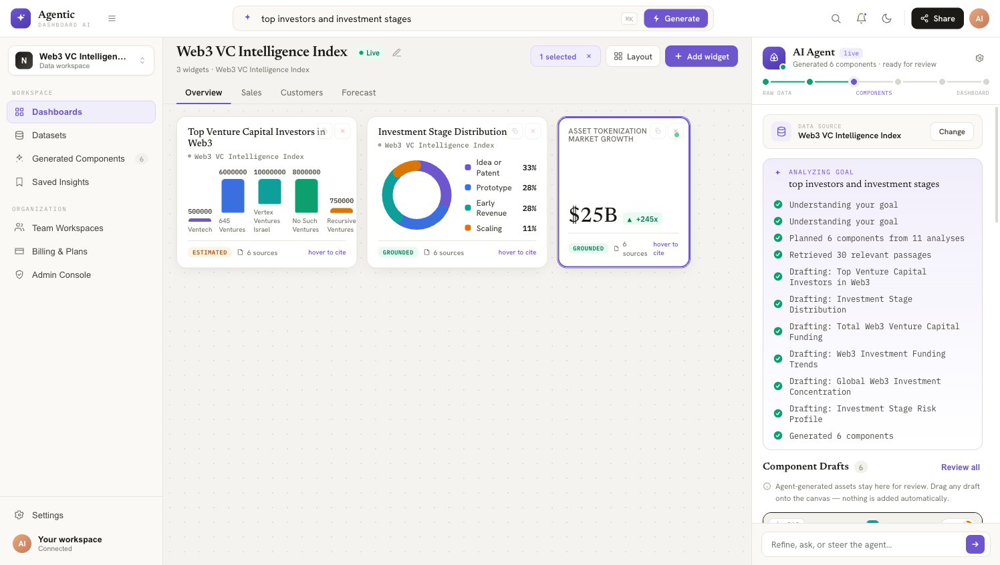

# Cogni Board

Turn a natural-language goal into a **real, sourced analytics dashboard**. You connect a
dataset (via [Inflectiv](https://app.inflectiv.ai)), describe what you want to analyze, and
an autonomous agent plans sub-queries, retrieves the relevant data, and structures it into
dashboard components — **every number carries a citation back to its source passages**.

> Built on a vector/RAG data layer (Inflectiv) + LLM (OpenRouter), with a FastAPI +
> Postgres + Redis backend and a single-page UI served from the same service.



---

## Highlights

- **One-prompt dashboards** — describe a goal, the agent generates draft components (KPIs, charts, forecasts, insights, risk cards) you drag onto a grid.
- **Live agent reasoning** — real plan → retrieve → structure steps streamed over SSE.
- **Provenance on every component** — "grounded vs. estimated" honesty + the exact source chunks behind each number.
- **Per-dataset recommended queries** — generated from the dataset's profile at connect time.
- **Real accounts & persistence** — sign-up/onboarding captures the Inflectiv key per user; dashboards, components, insights, settings persist in Postgres.
- **Survives refresh** — the working canvas auto-saves and restores across reloads/tabs.

## Tech stack

| Layer | Tech |
|------|------|
| Frontend | `dc-runtime` (React 18 under the hood) single-page `.dc.html`, vendored React |
| Backend | FastAPI (Python) |
| Database | PostgreSQL (`psycopg2`) |
| Cache | Redis (in-memory fallback if absent) |
| Data / RAG | Inflectiv API |
| LLM | OpenRouter (Claude) |

## Repository layout

```
.
├── frontend/                  # the UI (served by the backend as static files)
│   ├── Agentic Auth.dc.html         # sign in / sign up / onboarding / reset
│   ├── Agentic Dashboard AI.dc.html # the AI dashboard builder
│   ├── Agentic App.dc.html          # app shell: profile, datasets, components, insights, team, billing, admin, settings
│   ├── support.js                   # the dc-runtime
│   └── vendor/                      # vendored React/ReactDOM (no CDN dependency)
├── backend/                   # FastAPI app
│   ├── main.py                # routes, startup, serves frontend/
│   ├── routes_app.py          # auth + persistence REST API
│   ├── auth.py  db.py         # token auth + Postgres layer
│   ├── pipeline.py profiler.py prompts.py   # the agent (plan→retrieve→structure)
│   ├── inflectiv.py openrouter.py cache.py  # external clients + Redis cache
│   ├── requirements.txt
│   └── .env.example
├── docs/                      # architecture, design specs, screenshots
├── requirements.txt  Procfile  railway.json  runtime.txt   # deploy config
└── .gitignore
```

See [docs/ARCHITECTURE.md](docs/ARCHITECTURE.md) for the data flow and API reference, and
[docs/STATUS.md](docs/STATUS.md) for the feature/test status (what's done, partial, and left).

---

## Run locally

**Prereqs:** Python 3.12, Postgres + Redis (Docker is easiest), an OpenRouter API key, and an Inflectiv account/key.

```bash
# 1. infra (Docker)
docker run -d --name pg    -e POSTGRES_PASSWORD=ada -e POSTGRES_DB=ada -p 5432:5432 postgres:16-alpine
docker run -d --name redis -p 6379:6379 redis:7-alpine

# 2. backend env
cd backend
cp .env.example .env          # then edit: set OPENROUTER_API_KEY, DATABASE_URL, REDIS_URL
python3 -m venv .venv && source .venv/bin/activate
pip install -r requirements.txt

# 3. run (serves API + UI on one port)
cd ..
uvicorn main:app --app-dir backend --port 8000
```

Open **http://localhost:8000/Agentic%20Auth.dc.html** → sign up → on the "Connect data"
step paste your Inflectiv global key and pick a dataset → you land on a pre-connected
dashboard. Type a goal (or a recommended chip) and watch it build.

`init_db()` creates all tables on first boot. Tables are auto-created; no migrations.

---

## Deploy (Railway)

The whole app is **one service** (FastAPI serves the API and the `frontend/`), so the
relative `/api` calls and CORS "just work".

1. **New Project → Deploy from GitHub repo** (this repo, default root).
2. Add the **PostgreSQL** plugin and the **Redis** plugin → they inject `DATABASE_URL` and `REDIS_URL`.
3. Set service variables:
   - `OPENROUTER_API_KEY` (required)
   - `OPENROUTER_MODEL_FAST` / `OPENROUTER_MODEL_STRONG` (optional, defaults provided)
   - `INFLECTIV_BASE=https://app.inflectiv.ai/api/platform`
4. Deploy. Start command (already in `railway.json` / `Procfile`):
   `uvicorn main:app --app-dir backend --host 0.0.0.0 --port $PORT`
5. Open the generated URL at `/Agentic%20Auth.dc.html`.

> The container filesystem is ephemeral — all state lives in Postgres, so it survives redeploys.

## Environment variables

| Var | Required | Notes |
|-----|----------|-------|
| `DATABASE_URL` | yes | Postgres connection string (Railway auto-injects) |
| `OPENROUTER_API_KEY` | yes | LLM access |
| `REDIS_URL` | no | falls back to in-memory cache |
| `INFLECTIV_BASE` | no | defaults to the public Inflectiv base |
| `OPENROUTER_MODEL_FAST` / `OPENROUTER_MODEL_STRONG` | no | model ids |
| `DEFAULT_TOP_K` / `DEFAULT_SCORE_THRESHOLD` | no | retrieval tuning |

`GET /api/health` returns `{ok, openrouter, db, cache}` for a quick smoke check.

## Security note

Secrets live only in `backend/.env` (gitignored) or the host's env. The Inflectiv key is
stored per-user server-side; the browser only holds an opaque session token.
